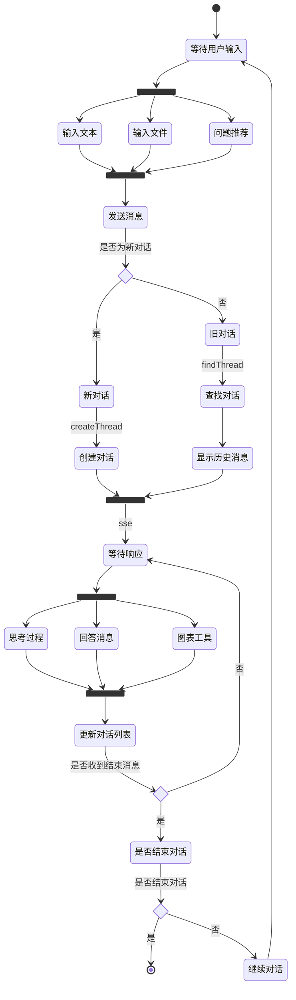
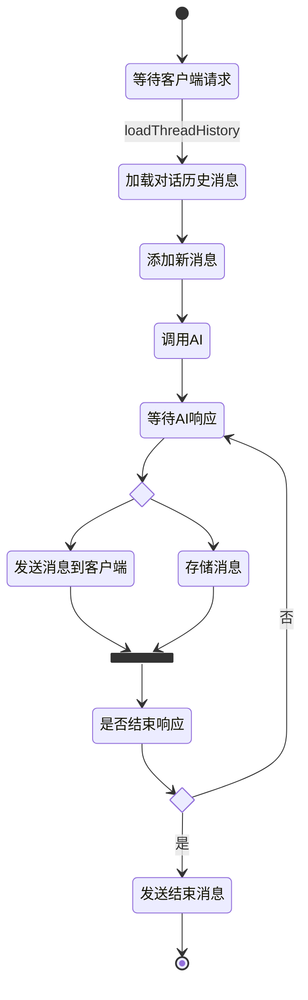

# 流程图

## 对话流程图

web 端

```mermaid
stateDiagram-v2
    

    [*] --> 等待用户输入
    state input_method <<fork>>
    等待用户输入 --> input_method
    input_method --> 输入文本
    input_method --> 输入文件
    input_method --> 问题推荐

    state send_wait <<join>>
    输入文本 --> send_wait
    输入文件 --> send_wait
    问题推荐 --> send_wait

    state is_new <<choice>>
    send_wait --> 发送消息
    发送消息 --> is_new: 是否为新对话
    is_new --> 新对话: 是
    is_new --> 旧对话: 否

    新对话 --> 创建对话: createThread

    旧对话 --> 查找对话: findThread
    查找对话 --> 显示历史消息

    state send_message <<join>>
    创建对话 --> send_message
    显示历史消息 --> send_message

    send_message --> 等待响应: sse

    state response_wait <<join>>
    等待响应 --> response_wait

    response_wait --> 思考过程
    response_wait --> 回答消息
    response_wait --> 图表工具

    state display_message <<join>>
    思考过程 --> display_message
    回答消息 --> display_message
    图表工具 --> display_message

    display_message --> 更新对话列表
    
    state response_end <<choice>>

    更新对话列表 --> response_end : 是否收到结束消息
    response_end --> 是否结束对话 : 是
    response_end --> 等待响应: 否

    state is_end <<choice>>
    是否结束对话 --> is_end : 是否结束对话
    is_end --> [*] : 是
    is_end --> 继续对话 : 否

    继续对话 --> 等待用户输入

```

server 端

```mermaid
stateDiagram-v2

    [*] --> 等待客户端请求

    等待客户端请求 --> 加载对话历史消息: loadThreadHistory

    加载对话历史消息 --> 添加新消息

    添加新消息 --> 调用AI

    调用AI --> 等待AI响应

    state ai_response <<choice>>
    等待AI响应 --> ai_response
    ai_response --> 发送消息到客户端
    ai_response --> 存储消息

    state response_wait <<join>>
    发送消息到客户端 --> response_wait
    存储消息 --> response_wait

    state is_end <<choice>>
    response_wait --> 是否结束响应
    是否结束响应 --> is_end
    is_end --> 发送结束消息 : 是
    is_end --> 等待AI响应 : 否

    发送结束消息 --> [*]


```

## 对话存储文件结构
