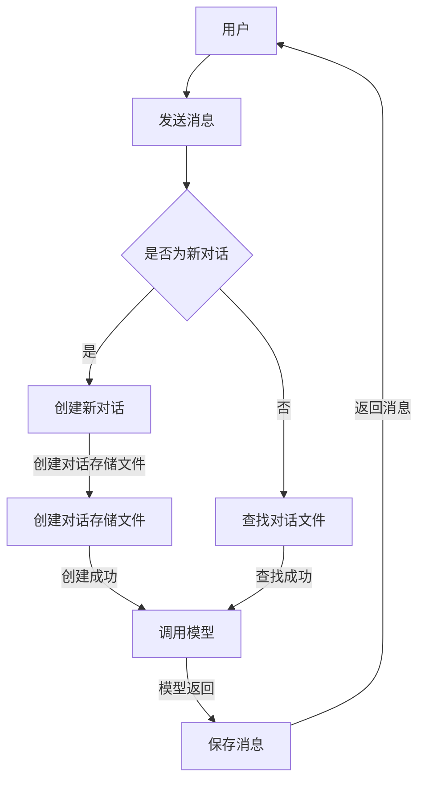

# 对话流程图

```mermaid
graph TD
    U[用户] --> M[发送消息]
    M --> IF{是否为新对话}
    IF -->|是| Create[创建新对话]
    IF -->|否| FindFile[查找对话文件]
    Create-->|创建对话存储文件| CreateFile[创建对话存储文件]
    CreateFile-->|创建成功| LLM[调用模型]
    FindFile-->|查找成功| LLM

    LLM-->|模型返回| Save[保存消息]
    Save-->|返回消息| U
```

## 对话存储文件结构

使用纯文本 + XML 标记格式存储对话，方便解析和流处理
