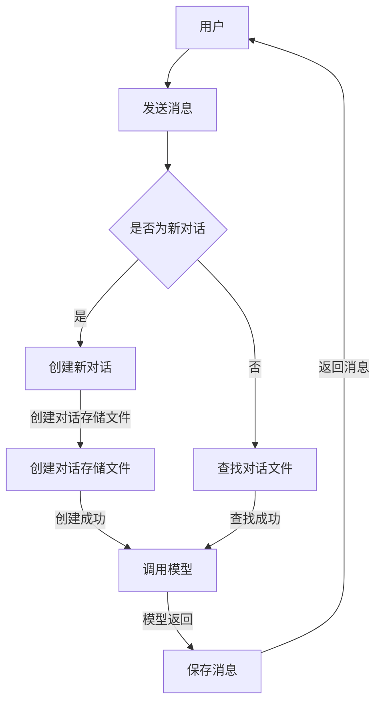
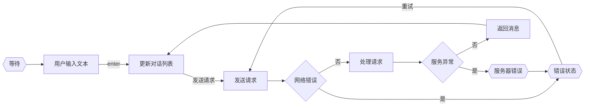
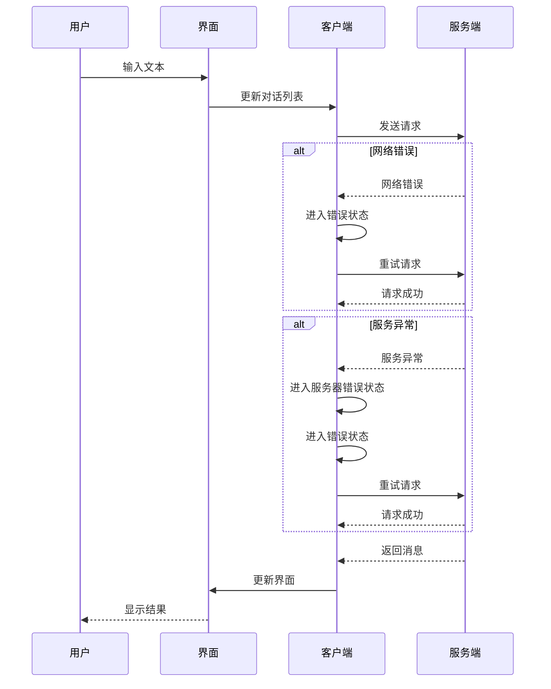
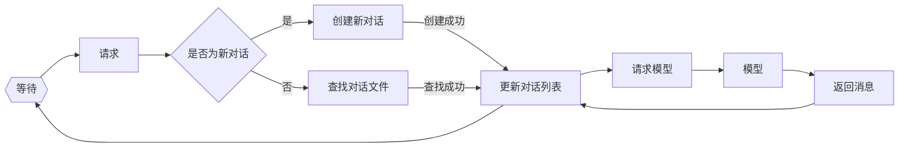
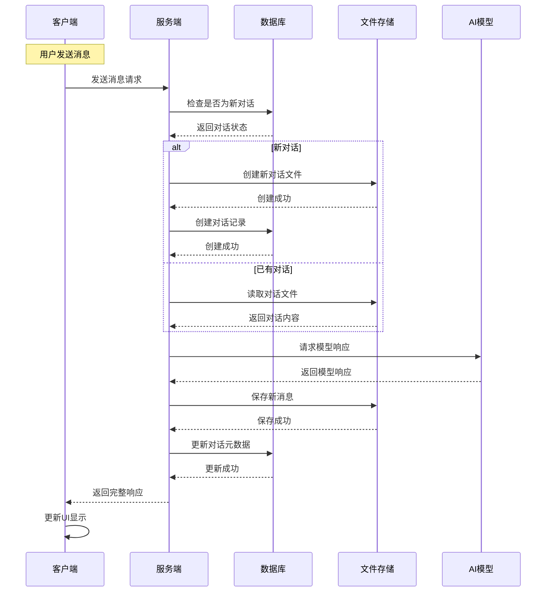

# 对话流程图

```mermaid
graph TD
    U[用户] --> M[发送消息]
    M --> IF{是否为新对话}
    IF -->|是| Create[创建新对话]
    IF -->|否| FindFile[查找对话文件]
    Create-->|创建对话存储文件| CreateFile[创建对话存储文件]
    CreateFile-->|创建成功| LLM[调用模型]
    FindFile-->|查找成功| LLM

    LLM-->|模型返回| Save[保存消息]
    Save-->|返回消息| U
```

## 对话存储文件结构

使用纯文本 + XML 标记格式存储对话，方便解析和流处理

## 对话流程图

**客户端**

```mermaid
graph LR
    Pending{{等待}} --> Input[用户输入文本]
    Input --enter--> Update[更新对话列表]
    Update -->|发送请求| Request[发送请求]
    Request --> NetworkError{网络错误}
    NetworkError --否-->Process[处理请求]
    NetworkError --是-->ErrorState{{错误状态}}
    ErrorState -->|重试| Request
    Process --> ServerError{服务异常}
    ServerError --是--> ServerErrorState{{服务器错误}}
    ServerErrorState -->ErrorState
    ServerError --否--> Response[返回消息]
    Response --> Update
```

```mermaid
sequenceDiagram
    participant User as 用户
    participant UI as 界面
    participant Client as 客户端
    participant Server as 服务端

    %% 正常流程
    User->>UI: 输入文本
    UI->>Client: 更新对话列表
    Client->>Server: 发送请求

    %% 网络错误处理
    alt 网络错误
        Server-->>Client: 网络错误
        Client->>Client: 进入错误状态
        Client->>Server: 重试请求
        Server-->>Client: 请求成功
    end

    %% 服务异常处理
    alt 服务异常
        Server-->>Client: 服务异常
        Client->>Client: 进入服务器错误状态
        Client->>Client: 进入错误状态
        Client->>Server: 重试请求
        Server-->>Client: 请求成功
    end

    %% 正常响应
    Server-->>Client: 返回消息
    Client->>UI: 更新界面
    UI-->>User: 显示结果
```

服务端

```mermaid
graph LR
    PendingState{{等待}} --> Request[请求]
    Request --> IsNewConversation{是否为新对话}
    IsNewConversation --是--> Create[创建新对话]
    IsNewConversation --否--> FindFile[查找对话文件]
    Create -->|创建成功| Update[更新对话列表]
    FindFile -->|查找成功| Update
    Update --> RequestLLM[请求模型]
    RequestLLM --> LLM[模型]
    LLM --> Response[返回消息]
    Response --> Update
    Update --> PendingState
```

```mermaid
sequenceDiagram
    participant Client as 客户端
    participant Server as 服务端
    participant DB as 数据库
    participant File as 文件存储
    participant LLM as AI模型

    %% 新对话流程
    Note over Client: 用户发送消息
    Client->>Server: 发送消息请求
    Server->>DB: 检查是否为新对话
    DB-->>Server: 返回对话状态

    alt 新对话
        Server->>File: 创建新对话文件
        File-->>Server: 创建成功
        Server->>DB: 创建对话记录
        DB-->>Server: 创建成功
    else 已有对话
        Server->>File: 读取对话文件
        File-->>Server: 返回对话内容
    end

    Server->>LLM: 请求模型响应
    LLM-->>Server: 返回模型响应
    Server->>File: 保存新消息
    File-->>Server: 保存成功
    Server->>DB: 更新对话元数据
    DB-->>Server: 更新成功
    Server-->>Client: 返回完整响应
    Client->>Client: 更新UI显示
```
